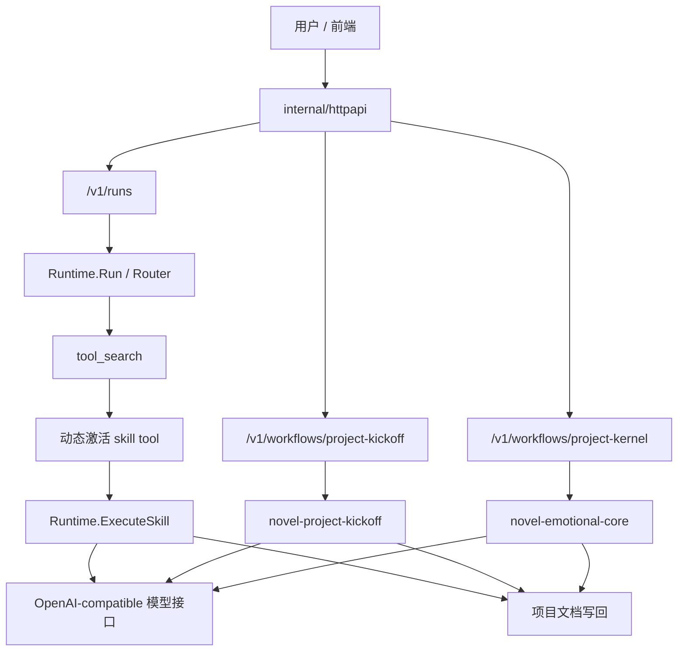

# 业务架构

当前后端有两条清晰的业务入口：

1. 通用运行链：`POST /v1/runs`
2. 固定初始化链：
   - `POST /v1/workflows/project-kickoff`
   - `POST /v1/workflows/project-kernel`

## 架构图

## 三层职责

### 1. API 层

负责：

- HTTP 协议
- 请求校验
- 选择执行链
- 组织响应

代码位置：

- [internal/httpapi](/C:/Users/admin/Desktop/novel-knowledge-assets-v0.1/backend/internal/httpapi)

这一层现在又分成三小层：

- `routes_*`: 路由层
- `*_service.go`: service 编排层
- `*_store.go` / `project_document_provider.go`: 适配层

### 2. 运行时层

负责：

- router
- `tool_search`
- skill 激活
- skill prompt 组装
- 工具调用

代码位置：

- `internal/runtime`
- `internal/skill`
- `internal/workflow`

### 3. 持久化层

负责：

- PostgreSQL
- Redis cache
- 文件系统镜像
- run artifact 落盘

代码位置：

- `internal/store`
- `internal/cache`
- `internal/projectfs`

## 为什么 `kickoff` 和 `kernel` 不能走 search

因为这两步不是开放式问答，而是固定初始化动作。

它们有明确的：

- 输入角色
- 输出文档
- skill 归属
- 后处理逻辑

所以这两条链走固定 workflow 更稳，避免把“产品初始化流程”误做成“技能发现问题”。
