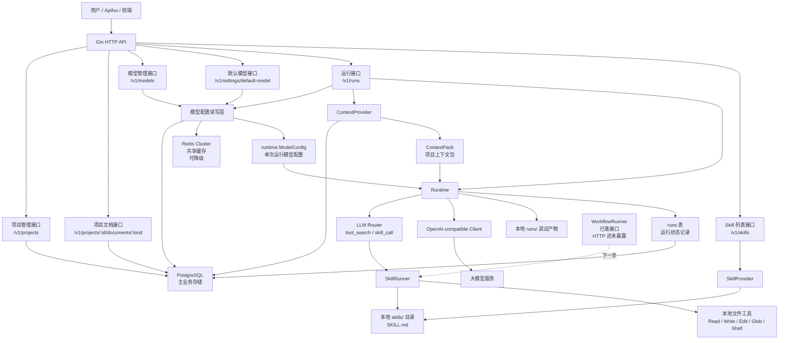

# 业务架构图

当前系统已经具备项目管理、项目文档管理、模型管理、默认模型设置、运行接口，以及 Skill/Workflow 的基础边界。



## 当前业务链路

```text
创建项目
  -> 保存世界观/角色/主线等项目文档
  -> 配置模型
  -> 设置默认模型
  -> 发起 /v1/runs
  -> 系统读取项目上下文
  -> 系统读取模型配置
  -> runtime 调模型
  -> 必要时调用 skill
  -> 返回结果并记录 run
```

## 下一步产品闭环

下一步应把 workflow 从内部边界升级为 HTTP 产品接口，例如：

```text
POST /v1/workflows/project-bootstrap
POST /v1/workflows/chapter-draft
POST /v1/workflows/chapter-snapshot
```

这样可以把“初始化世界观、生成角色卡、规划主线、生成章节草稿、审校连续性、更新项目状态”从用户手写提示词升级成明确的产品流程。

## 2026-04-28 Project / Model Cache Boundary

The current control plane uses PostgreSQL as the source of truth and Redis as a shared cache:

- `projects`: stored in PostgreSQL, cached in Redis by `project_id`.
- `model_profiles`: stored in PostgreSQL, cached in Redis by `model_id`.
- `default_model_id`: stored in PostgreSQL app settings, cached in Redis.

Project records now include storage location metadata:

- `storage_provider`: `filesystem` or `s3`.
- `storage_bucket`: required for `s3`; empty for local filesystem mode.
- `storage_prefix`: folder name or S3 key prefix for project artifacts.

Read flow:

```text
HTTP request
  -> Redis lookup by id
  -> on miss, PostgreSQL lookup
  -> immediate Redis backfill
  -> return project/model/default config
```

Write flow:

```text
HTTP mutation
  -> write PostgreSQL first
  -> return source-of-truth result
  -> background goroutine syncs Redis
```

This keeps project/model CRUD reliable even when Redis is temporarily unavailable. Runtime reads can still use hot Redis data, while PostgreSQL remains authoritative for correctness checks such as preventing deletion of the current default model.
