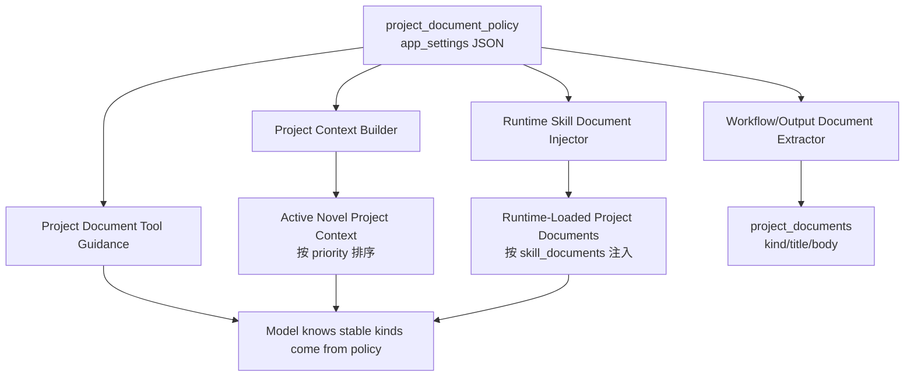
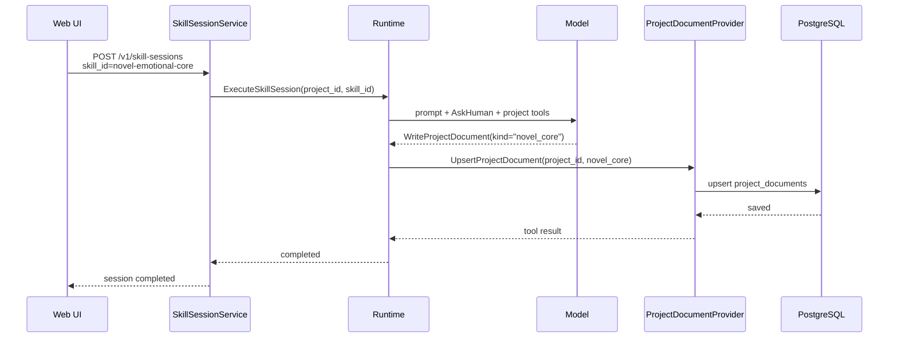
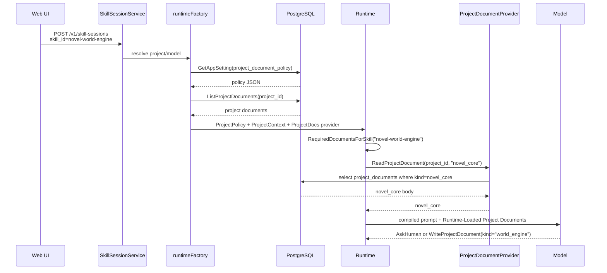
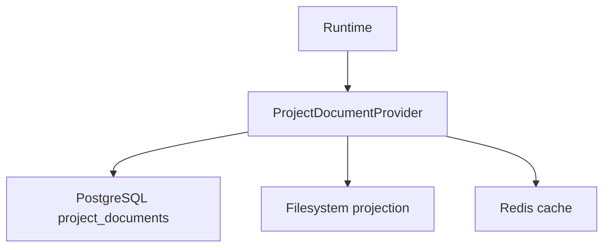

# Project Document Policy 业务说明

`project_document_policy` 是小说项目文档系统的统一业务配置。

它回答三个问题：

```text
这个项目允许沉淀哪些正式文档？
这些文档进入上下文时按什么顺序排列？
某个 skill 启动前，runtime 应该自动带上哪些已有项目文档？
```

它不是某个 skill 的私有规则，也不是 runtime 里写死的一段判断。

它的存储位置是：

```text
postgres.app_settings
  key   = "project_document_policy"
  value = JSON policy
```

## 为什么需要它

没有 `project_document_policy` 时，一个新文档 kind 会牵动很多地方：

- `documents.go` 要知道它是不是可持久化文档。
- `project.go` 要知道它在上下文里排第几。
- SQL 查询可能要写 `CASE WHEN kind = ...` 做排序。
- runtime 工具提示要列出推荐 kind。
- 每个 skill 可能会把“先读哪些文档”写死。
- workflow 后处理还要知道哪些标题能被提取和写回。

这会导致一个问题：

```text
新增 world_engine 或调整 skill 前后顺序
  -> 改代码
  -> 改 SQL
  -> 改 skill 文案
  -> 改测试
  -> 很容易漏一处
```

`project_document_policy` 的意义是把这些业务规则收敛到一份 PG 配置里。

以后要新增文档、调整排序、改变某个 skill 需要预加载的文档，优先改这份配置，而不是在 runtime、SQL、skill 里到处补 if/else。

## Policy 长什么样

当前默认 seed：

```json
{
  "documents": [
    {"kind": "novel_core", "title": "小说情感内核", "priority": 0},
    {"kind": "project_brief", "title": "项目简报", "priority": 10},
    {"kind": "reader_contract", "title": "读者承诺", "priority": 20},
    {"kind": "style_guide", "title": "风格指南", "priority": 30},
    {"kind": "taboo", "title": "禁区与避坑", "priority": 40},
    {"kind": "world_engine", "title": "小说世界压力引擎", "priority": 50},
    {"kind": "character_cast", "title": "角色台账", "priority": 55},
    {"kind": "world_rules", "title": "世界规则", "priority": 60},
    {"kind": "power_system", "title": "能力体系", "priority": 70},
    {"kind": "factions", "title": "势力关系", "priority": 80},
    {"kind": "locations", "title": "地点设定", "priority": 90},
    {"kind": "mainline", "title": "主线规划", "priority": 100},
    {"kind": "current_state", "title": "当前状态", "priority": 110}
  ],
  "skill_documents": {
    "novel-world-engine": ["novel_core"],
    "novel-reader-contract": ["novel_core", "world_engine"],
    "novel-character-pressure-engine": ["novel_core", "world_engine", "reader_contract", "project_brief", "taboo"],
    "novel-rules-power-engine": ["novel_core", "world_engine", "reader_contract", "character_cast"],
    "novel-mainline-engine": ["novel_core", "reader_contract", "world_engine", "character_cast", "world_rules", "power_system", "taboo"],
    "novel-opening-package": ["novel_core", "reader_contract", "world_engine", "character_cast", "world_rules", "power_system", "mainline", "taboo", "style_guide"],
    "novel-style-guide": ["novel_core", "reader_contract", "project_brief"],
    "novel-continuity-snapshot": ["novel_core", "mainline", "current_state"]
  }
}
```

字段含义：

| 字段 | 含义 |
|---|---|
| `documents` | 这个系统认识的正式项目文档 kind 列表 |
| `documents[].kind` | 稳定文档类型，例如 `novel_core`、`world_engine` |
| `documents[].title` | 默认中文标题，用于写回、提取、展示 |
| `documents[].priority` | 上下文排序优先级，数字越小越靠前 |
| `skill_documents` | skill 启动前需要 runtime 自动注入的项目文档 |
| `skill_documents["novel-world-engine"]` | 运行 `novel-world-engine` 前先加载哪些 kind |

## 它在整体业务里的位置



核心作用可以拆成四层。

### 1. 定义正式项目资产

`documents` 决定哪些 kind 是正式项目资产。

例如：

```text
novel_core      小说情感内核
world_engine    小说世界压力引擎
character_cast  角色台账
world_rules     世界规则
power_system    能力体系
```

这些 kind 不是临时聊天字段，而是可以进入：

```text
project_documents(project_id, kind, title, body, metadata)
```

的长期资产。

### 2. 定义上下文排序

runtime 构建项目上下文时，会读取当前 project 的所有 project documents。

但不是按数据库更新时间随便塞给模型，而是按 policy 的 `priority` 排：

```text
novel_core
  -> project_brief
  -> reader_contract
  -> style_guide
  -> taboo
  -> world_engine
  -> world_rules
  -> power_system
  -> ...
```

这保证最重要的 canon 先进入 prompt。

对于小说项目，`novel_core` 应该长期排在最前，因为它控制全书情绪承诺。

### 3. 定义 skill 启动前要自动带什么

`skill_documents` 是跨 skill 产物传递的核心。

例如：

```json
{
  "skill_documents": {
    "novel-world-engine": ["novel_core"]
  }
}
```

意思是：

```text
当用户启动 novel-world-engine
  -> runtime 查 policy
  -> 发现它需要 novel_core
  -> runtime 通过 ProjectDocumentProvider 读取 project_documents(kind=novel_core)
  -> 把正文注入到 compiled prompt 的 Runtime-Loaded Project Documents
```

所以 `novel-world-engine` 不需要自己写死：

```text
先 ReadProjectDocument(kind="novel_core")
```

它也不应该去猜：

```text
projects/{storage_prefix}/documents/novel_core.md
```

读取动作由 runtime 统一处理，底层数据源由 provider 负责。

### 4. 定义文档提取和写回的默认标题

当 workflow 或后处理要从模型输出里提取：

```markdown
## world_engine
...
```

时，policy 决定：

```text
world_engine 是不是可持久化 kind
默认 title 是不是 小说世界压力引擎
```

这避免写回层自己维护第二份 kind/title 映射。

## 完整业务流程：从内核到世界引擎

### 第一步：创建 novel_core



保存结果：

```text
project_documents
  project_id = 当前项目
  kind       = novel_core
  title      = 小说情感内核
  body       = 模型最终定稿正文
```

### 第二步：启动 novel-world-engine



模型在第二步看到的核心上下文来自两部分：

```text
Active Novel Project Context
  所有项目文档按 policy.priority 排序后的摘要/正文

Runtime-Loaded Project Documents
  当前 skill 按 policy.skill_documents 显式要求的文档
```

对 `novel-world-engine` 来说，最重要的是：

```text
Runtime-Loaded Project Documents
  ## 小说情感内核 (novel_core)
  ...
```

这就是“跑第二个任务时自动带上第一个产物”的机制。

## 配置变更流程

### 查看当前 policy

```http
GET /v1/settings/project-document-policy
```

返回：

```json
{
  "key": "project_document_policy",
  "value": {
    "documents": [],
    "skill_documents": {}
  }
}
```

### 更新当前 policy

```http
PUT /v1/settings/project-document-policy
Content-Type: application/json
```

```json
{
  "value": {
    "documents": [
      {"kind": "novel_core", "title": "小说情感内核", "priority": 0},
      {"kind": "world_engine", "title": "小说世界压力引擎", "priority": 50},
      {"kind": "world_rules", "title": "世界规则", "priority": 60}
    ],
    "skill_documents": {
      "novel-world-engine": ["novel_core"],
      "some-future-skill": ["novel_core", "world_engine"]
    }
  }
}
```

更新后，下一个 skill-session 会读取新 policy。

不需要重写 skill，也不需要修改 SQL 排序。

## 和 provider 的关系

`project_document_policy` 不负责真正存储项目文档。

它只负责告诉 runtime：

```text
哪些 kind 是正式项目文档
什么顺序进入上下文
哪个 skill 需要哪些已有文档
```

真正读写项目文档的是 provider：



所以业务 skill 应该依赖：

```text
ReadProjectDocument / WriteProjectDocument / runtime 自动注入
```

而不是依赖：

```text
本地文件路径
S3 bucket
Redis key
数据库表结构
```

底层以后从 filesystem projection 换成 S3，也不应该影响 skill 写法。

## 它不是什么

`project_document_policy` 不是：

- 项目文档正文。
- 单本小说的内容设定。
- skill 的完整执行流程。
- workflow 编排器。
- prompt 模板。
- 文件路径规则。

它只是业务配置层。

更准确地说，它是：

```text
项目资产类型系统 + 上下文排序规则 + skill 前置文档依赖表
```

## 设计边界

### 应该放进 policy 的东西

- 新增正式项目文档 kind。
- 调整项目上下文排序。
- 某个 skill 启动前必须自动带上的项目文档。
- 默认文档标题。

### 不应该放进 policy 的东西

- 具体某本书的 `novel_core` 正文。
- 某个 skill 的大段创作规则。
- AskHuman 具体问题列表。
- 模型参数。
- HTTP 路由配置。
- storage provider 的底层实现细节。

## 常见修改场景

### 新增一个正式文档 kind

例如后续新增 `relationship_ledger`：

```json
{
  "kind": "relationship_ledger",
  "title": "关系变化台账",
  "priority": 86
}
```

加到 `documents` 里后：

- `BuildContextWithPolicy` 会按 priority 排序。
- `ExtractDocumentDraftsWithPolicy` 会识别 `## relationship_ledger`。
- 工具提示会把 kind 视为 policy 管理的稳定类型。

### 让某个 skill 自动带更多文档

例如让 `novel-world-engine` 同时带 `reader_contract`：

```json
{
  "skill_documents": {
    "novel-world-engine": ["novel_core", "reader_contract"]
  }
}
```

下一次执行时，runtime 会同时读取两份文档并注入 prompt。

### 调整上下文顺序

如果希望 `world_engine` 比 `taboo` 更早进入上下文，只改 priority：

```json
{"kind": "world_engine", "title": "小说世界压力引擎", "priority": 35}
```

这类变化不应该再改 SQL `ORDER BY CASE`。

## 失败和降级

如果 PG 里没有 `project_document_policy`，runtime 会使用代码里的 `DefaultDocumentPolicy()` 作为 fallback。

如果 policy JSON 解析失败，也会 fallback 到默认策略。

这个 fallback 只保证系统不崩，不应该成为长期配置方式。正式环境应该通过 migration 或 API 写入 PG。

如果 policy 指定某个 skill 需要 `novel_core`，但项目里没有 `novel_core`：

```text
runtime 会在 prompt 里说明缺少配置要求的文档
skill 应该调用 AskHuman
不得瞎编 canon
不得通过文件路径猜测
```

## 一句话总结

`project_document_policy` 是让小说项目从“每个 skill 各自猜上下文”变成“runtime 按统一配置分发项目资产”的中枢。

它的价值不是多一个配置文件，而是减少业务规则分叉：

```text
改一个地方
  -> context 排序变
  -> skill 自动注入变
  -> 文档提取识别变
  -> 写回默认标题变
```

这就是它在整体业务中的作用和意义。
