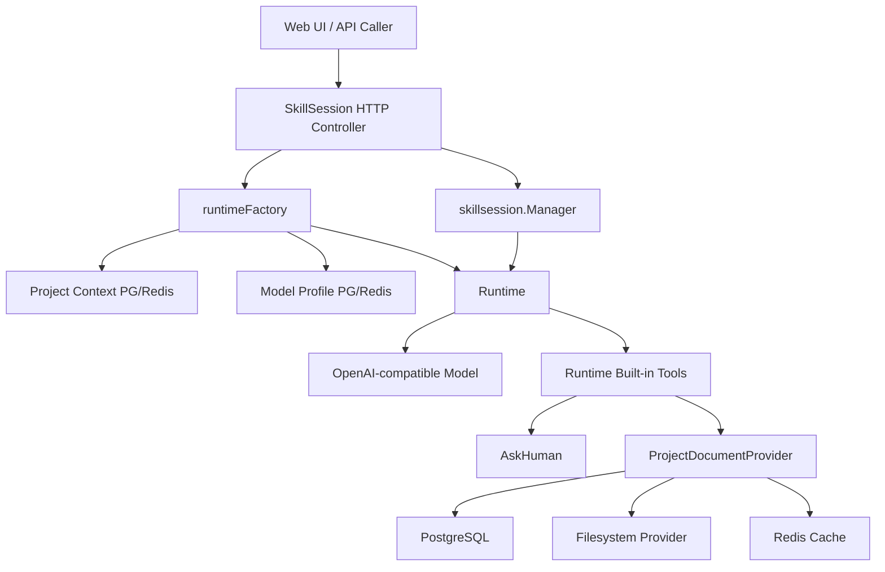
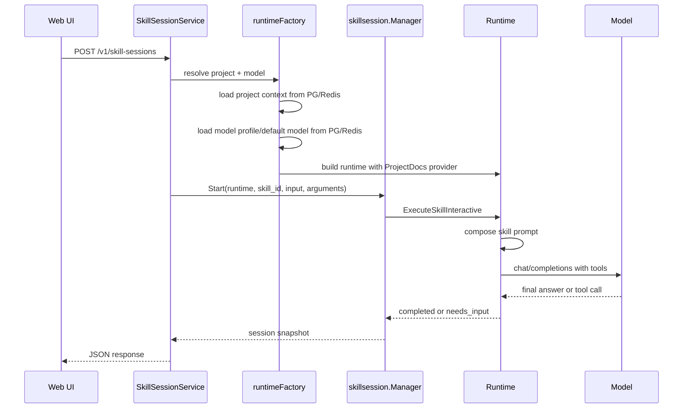
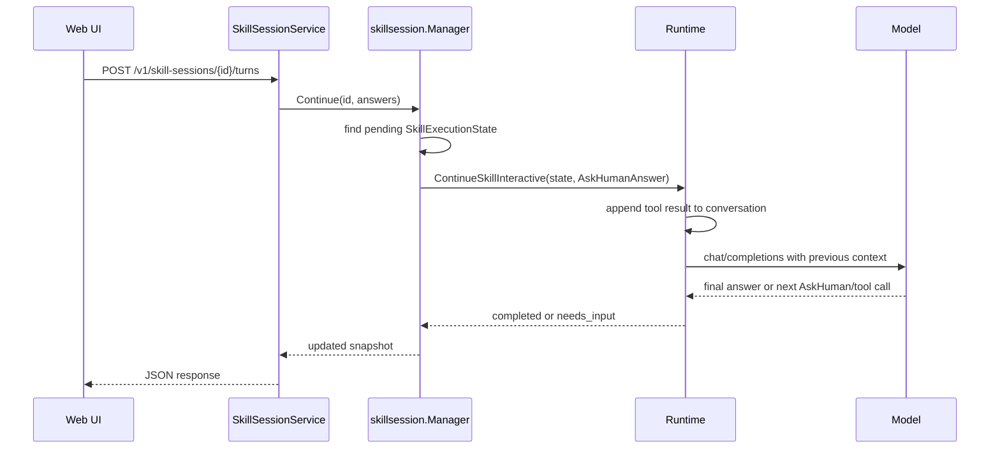
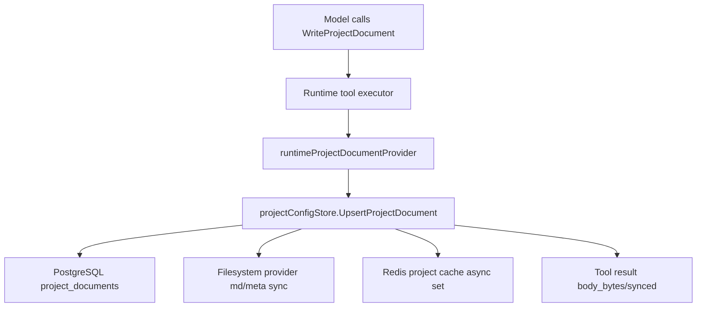
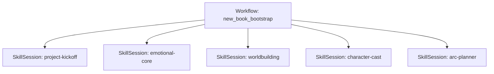

# Skill Session 业务流程全景

这份文档说明 `skill-session` 模块在产品里的完整作用：它怎么接住模型的反问，怎么等待人类补充信息，怎么带着原上下文继续发给模型，以及最后怎么通过 provider 写入项目资产。

## 结论

`skill-session` 是“单个 skill 的多轮交互控制器”。

它解决的问题是：

```text
用户提出任务
  -> 明确调用某个 skill
  -> 模型发现缺少关键信息
  -> 模型调用 AskHuman
  -> 服务端暂停 skill
  -> 前端展示问题
  -> 人类补充答案
  -> 服务端把答案作为 tool result 塞回原对话
  -> 模型继续完成 skill
  -> 如果需要持久化项目文档，仍然调用 WriteProjectDocument
```

它不替代 runtime，也不替代 provider。

- runtime 负责模型调用、prompt 组装、tool 暴露和 tool 执行。
- skill-session 负责暂停、保存会话状态、恢复会话。
- provider 负责项目文档的 PG / filesystem / Redis 同步。
- workflow 负责多个 skill 的产品级编排，不应该自己实现 AskHuman 状态机。

## 模块边界



核心原则：

| 模块 | 负责 | 不负责 |
|---|---|---|
| `SkillSessionService` | HTTP 请求、解析 project/model、创建 runtime | 直接写文档、直接写 Redis |
| `skillsession.Manager` | session 状态、pending AskHuman、继续执行 | 理解小说业务、写项目资产 |
| `Runtime` | 调模型、暴露工具、执行工具、暂停/恢复 primitive | 多 skill 产品编排 |
| `AskHuman` | 请求人类补充信息 | 修改 PG/Redis/FS |
| `WriteProjectDocument` | 通过 provider 写项目文档 | 管理 session 状态 |
| `workflow` | 多 skill 顺序、产品流程、产物规则 | 自己实现多轮问答状态机 |

## 当前 API

### 1. 创建 session

```http
POST /v1/skill-sessions
Content-Type: application/json
```

```json
{
  "project": "urban-rebirth",
  "model": "deepseek-flash",
  "skill_id": "novel-emotional-core",
  "input": "先做小说情感内核，缺少信息就问我，不要直接猜。",
  "arguments": {
    "document_kind": "novel_core"
  },
  "debug": true
}
```

返回有两种结果。

如果模型直接完成：

```json
{
  "session": {
    "id": "ss_20260429T011500.123456789",
    "status": "completed",
    "skill_id": "novel-emotional-core",
    "final_text": "..."
  }
}
```

如果模型需要人类补充：

```json
{
  "session": {
    "id": "ss_20260429T011500.123456789",
    "status": "needs_input",
    "skill_id": "novel-emotional-core",
    "ask_human": {
      "reason": "需要确认读者最核心的情绪回报。",
      "questions": [
        {
          "field": "payoff",
          "header": "爽点",
          "question": "主角最终给读者的核心情绪回报是什么？",
          "options": [
            {
              "label": "尊严",
              "description": "被重新看见、重新被尊重。"
            },
            {
              "label": "复仇",
              "description": "让曾经羞辱他的人付出代价。"
            }
          ]
        }
      ]
    }
  }
}
```

### 2. 查询 session

```http
GET /v1/skill-sessions/{id}
```

用途：

- 前端刷新页面后恢复当前状态。
- 查看是否还在等待人类输入。
- 查看历史 turns、run_id、run_dir。

注意：当前 session 存储是进程内存，服务重启后不能恢复。后续如果要多副本或重启恢复，需要把 `SkillExecutionState` 持久化到 PG 或 Redis。

### 3. 继续 session

```http
POST /v1/skill-sessions/{id}/turns
Content-Type: application/json
```

```json
{
  "input": "我选择尊严和重新被看见，不要简单暴富。",
  "answers": {
    "payoff": "尊严和重新被看见"
  },
  "notes": "主角是中年销售，被 KPI、债务、家庭责任压得喘不过气。"
}
```

服务端会把它转成 AskHuman 的 tool result：

```json
{
  "type": "human_answers",
  "answers": {
    "payoff": "尊严和重新被看见"
  },
  "notes": "主角是中年销售，被 KPI、债务、家庭责任压得喘不过气。"
}
```

然后追加到原 conversation 里继续请求模型。

## Start 流程



关键点：

1. project 是必选的，因为 session 是项目上下文里的 skill 执行。
2. model 可以显式传，不传则使用数据库里的 default model。
3. runtime 会注入 `ProjectContext`，并挂上 `ProjectDocumentProvider`。
4. skill prompt 里包含 skill metadata、tooling hint、原始用户输入、当前任务。
5. `AskHuman` 是所有 skill execution 默认可用的内置工具。

## AskHuman 暂停流程

模型如果觉得缺少信息，不能自己瞎补，应调用：

```json
{
  "name": "AskHuman",
  "arguments": {
    "reason": "需要确认核心情绪回报。",
    "questions": [
      {
        "field": "payoff",
        "question": "主角最终要给读者什么情绪回报？",
        "options": [
          {"label": "尊严"},
          {"label": "复仇"}
        ]
      }
    ]
  }
}
```

runtime 收到这个 tool call 后不会继续调用模型，而是返回 `needs_input`。

保存的关键状态：

```text
SkillExecutionState
  - SkillID
  - SafeID
  - OriginalUserInput
  - InvocationArgs
  - CompiledPrompt
  - Conversation
  - NextRound
  - PendingToolCallID
  - ReadState
```

其中最重要的是：

- `Conversation`：保留模型此前看到和说过的上下文。
- `PendingToolCallID`：标记人类答案要回复给哪一个 AskHuman tool call。
- `NextRound`：继续时从下一轮模型调用开始。

这保证了“继续”不是重新开始，而是在同一条模型对话里补上工具结果。

## Continue 流程



runtime 实际续上的消息类似：

```text
assistant:
  tool_calls:
    - id: ask_1
      name: AskHuman
      arguments: ...

tool:
  tool_call_id: ask_1
  content:
    {
      "type": "human_answers",
      "answers": {...},
      "notes": "..."
    }
```

所以模型继续时能看到：

1. 原始 skill prompt；
2. 项目上下文；
3. 它刚才问过的问题；
4. 人类刚补充的答案；
5. 当前仍可用的工具。

## 文档写入流程

session 不写项目文档。模型如果最终要落项目资产，必须调用 runtime tool：

```text
WriteProjectDocument
```

完整链路：



这和 workflow 的写文档链路是同一条：

```text
Runtime
  -> ProjectDocumentProvider
  -> projectConfigStore
  -> PostgreSQL
  -> filesystem provider
  -> Redis cache
```

因此 session 不会绕过 provider，也不会自己写本地文件。

## 和 Workflow 的关系

现在的关系：

```text
skill-session:
  单个 skill 的多轮交互

workflow:
  多个 skill 的产品级流程编排
```

短期建议：

- 明确知道要跑哪个 skill，并且可能需要模型反问：用 `/v1/skill-sessions`。
- 固定单步 workflow，例如 `project-kernel`，可以逐步弱化为 skill-session 的预设入口。
- 多步骤流程，例如“一键新书初始化”，仍然保留 workflow。

长期更合理的结构：



也就是：

- workflow 决定先后顺序；
- 每一步具体执行交给 skill-session；
- 如果某一步缺信息，workflow 不自己问人，而是把当前 session 返回给前端；
- 人类补充后继续该 session；
- 当前 step completed 后，workflow 再进入下一 step。

这部分目前还没有完全实现。当前 workflow 仍是固定一次性执行，或者通过 `response_mode=clarification` 返回文本式澄清。后续应该改成复用 `skillsession.Manager`。

## 前端应该怎么用

前端状态机可以很简单：

```text
idle
  -> start session
  -> running
  -> if completed: show final_text
  -> if needs_input: render ask_human.questions
  -> submit answers
  -> running
  -> repeat
```

UI 展示建议：

- `ask_human.reason` 放在问题组上方；
- 每个 `question.field` 作为表单字段 key；
- `options` 渲染为单选/多选；
- 允许用户补充 free text；
- 提交时同时发送：
  - `input`：人类自然语言总结；
  - `answers`：结构化字段；
  - `notes`：额外说明。

## 日志和调试

HTTP 日志：

- `skill_session.start.accepted`
- `skill_session.start.completed`
- `skill_session.continue.accepted`
- `skill_session.continue.completed`

runtime debug artifacts：

```text
runs/{run_id}/skill-calls/{skill_id}/compiled-prompt.md
runs/{run_id}/skill-calls/{skill_id}/allowed-tools.json
runs/{run_id}/skill-calls/{skill_id}/round-xx-assembly.json
runs/{run_id}/skill-calls/{skill_id}/round-xx-chat-request.json
runs/{run_id}/skill-calls/{skill_id}/round-xx-response.json
runs/{run_id}/skill-calls/{skill_id}/tools/AskHuman-{id}-request.json
```

这些文件用于解释：

- 模型当时看到了什么 prompt；
- 暴露了哪些工具；
- 模型为什么调用 AskHuman；
- 人类答案续回后模型怎么继续。

## 当前限制

1. session 当前是内存存储。
   - 服务重启会丢失 session。
   - 多副本部署时，同一个 session 必须回到同一个进程，否则找不到状态。

2. workflow 还没有完全复用 skill-session。
   - 固定 workflow 仍然是一次性执行。
   - 后续应该让 workflow step 可以创建或挂起 skill-session。

3. session 没有独立过期策略。
   - 当前需要后续补 TTL、清理任务、取消接口。

4. session 没有持久化 transcript 到 PG。
   - 当前 snapshot 在内存里。
   - runstore 有 debug artifacts，但不是业务状态源。

## 后续演进建议

### 第一阶段：完善当前单 skill session

- 增加 `DELETE /v1/skill-sessions/{id}` 用于取消。
- 增加 session TTL。
- 增加 session list，仅用于调试或后台管理。
- 增加 verification script：创建 session -> AskHuman -> continue -> WriteProjectDocument。

### 第二阶段：session 持久化

建议表：

```text
skill_sessions
  id
  project_id
  skill_id
  status
  request
  arguments
  ask_human
  final_text
  runtime_state
  run_id
  run_dir
  created_at
  updated_at
  expires_at
```

如果使用 Redis：

```text
novelrt:skill_session:{id}
```

但原则仍然是：

- PG 更适合长期审计和恢复；
- Redis 更适合短期会话缓存；
- 不要让 Redis 成为唯一业务状态源，除非明确接受重启丢失。

### 第三阶段：workflow 复用 session

目标：

```text
workflow step
  -> start skill session
  -> if needs_input: workflow paused
  -> human continues session
  -> step completed
  -> workflow advances to next step
```

这样 workflow 不再关心 AskHuman 细节，只关心 step 状态。

## 验收标准

一个完整 session 流程应该满足：

- 能指定 project、model、skill_id 启动；
- 能拿到项目上下文；
- 能拿到数据库模型配置；
- 模型缺信息时能调用 AskHuman；
- 服务端返回 `needs_input` 而不是瞎生成；
- 人类答案能作为 tool result 回到同一 conversation；
- 模型能继续完成；
- 模型能通过 `WriteProjectDocument` 写项目文档；
- 文档写入走 PG -> filesystem provider -> Redis cache sync；
- runstore 能看到完整 prompt、tools、request、response、tool call 调试文件。
