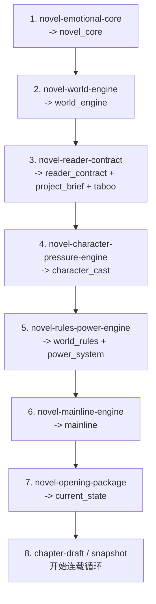

# 网文项目正式启动蓝图

这份文档定义：已经有 `novel_core` 和 `world_engine` 之后，正式启动一个可持续连载项目还必须补齐哪些 skill、哪些项目文档、每个 skill 应该引用什么、输出什么。

当前共识：

```text
不要急着写正文。
先把“读者为什么追”“主角为什么动”“世界为什么压”“剧情为什么能升级”四件事固化成项目资产。
```

已经完成的两个核心资产：

| 顺序 | Skill | 输出文档 | 作用 |
|---|---|---|---|
| 1 | `novel-emotional-core` | `novel_core` | 定义全书情绪承诺、主角痛点、爽点和禁区 |
| 2 | `novel-world-engine` | `world_engine` | 把情绪内核转成世界压力、稀缺资源、阶层秩序和冲突循环 |
| 3 | `novel-reader-contract` | `reader_contract`、`project_brief`、`taboo` | 把情绪和压力翻译成读者追读承诺、项目定位和禁区 |
| 4 | `novel-character-pressure-engine` | `character_cast` | 建立主角、压迫者、配角、关系变化和信息差 |
| 5 | `novel-rules-power-engine` | `world_rules`、`power_system` | 把世界压力落成规则边界、能力体系、升级资源和代价 |
| 6 | `novel-mainline-engine` | `mainline` | 规划第一卷、前 15 章、中期方向和伏笔接口 |
| 7 | `novel-opening-package` | `current_state` | 写第一章前建立开篇状态、场景、压力、目标和禁区 |

下一步不要先做 workflow，也不要先做正文生成。

下一步应该补齐“正式开书包”。

## 正式启动的最小资产集

一个项目达到“可以开始写第一章”的最低门槛：

| 文档 kind | 是否必须 | 作用 |
|---|---:|---|
| `novel_core` | 必须 | 全书情绪发动机 |
| `world_engine` | 必须 | 世界长期压迫和冲突发动机 |
| `reader_contract` | 必须 | 读者点进来、追下去、付费下去的承诺 |
| `project_brief` | 必须 | 一句话定位、题材、主角、卖点、前期钩子 |
| `taboo` | 必须 | 不写什么，避免跑偏 |
| `character_cast` | 必须 | 主角、核心压迫者、关键配角、信息差 |
| `world_rules` | 必须 | 世界规则、社会规则、能力规则的可执行边界 |
| `power_system` | 必须 | 主角能力来源、边界、代价、升级方式 |
| `mainline` | 必须 | 第一卷目标、近期 15 章、30-50 章方向 |
| `current_state` | 必须 | 开篇前的初始状态、第一章约束、已确认 canon |
| `style_guide` | 建议 | 文风、句法、叙述距离、对白、章末钩子 |
| `locations` | 可选 | 关键场景，如果强场景题材才提前做 |
| `factions` | 可选 | 如果势力结构复杂，可从 `character_cast` 拆出 |

这里最重要的新增 kind 是：

```text
character_cast
```

没有角色台账，后面的主线和章节会开始漂。短期也可以把角色写进 `project_brief` 或 `current_state`，但正式启动建议把它升成独立项目文档。

## 推荐 skill 创建顺序



这不是 workflow。它是 skill 设计顺序。

当前仍然走：

```text
skill-session
  -> 缺信息 AskHuman
  -> 信息足够 WriteProjectDocument
```

## Skill 设计总原则

每个新 skill 都必须回答四个问题：

```text
它读取哪些已有项目文档？
它只负责产出哪些项目文档？
缺少哪些信息时必须 AskHuman？
它绝对不能越权生成什么？
```

不要让一个 skill 同时做太多事。

好的 skill 是一个“资产生产器”，不是一个“万能创作助手”。

## 后续必须创建的 skill

### 3. `novel-reader-contract`

目标：

```text
把 novel_core 和 world_engine 翻译成读者承诺、商业切口、项目简报和禁区。
```

它解决的问题：

```text
读者为什么点进来？
读者前三章期待什么？
读者前十章追什么？
读者中期为什么还不弃？
这本书不能写成什么？
```

读取文档：

```json
{
  "novel-reader-contract": ["novel_core", "world_engine"]
}
```

输出文档：

```text
reader_contract
project_brief
taboo
```

AskHuman 触发条件：

- 不知道目标读者。
- 不知道平台气质。
- 不知道前三章的核心钩子。
- 不知道明确禁区。
- `novel_core` 和 `world_engine` 的爽点方向冲突。

禁止越权：

- 不写完整主线。
- 不写详细角色小传。
- 不写正文。
- 不重写 `novel_core`，除非用户明确要求改核心。

合格输出必须包含：

- 一句话卖点。
- 目标读者。
- 首章钩子承诺。
- 前 10 章回报节奏。
- 中期追读承诺。
- 付费驱动力。
- 禁区。

### 4. `novel-character-pressure-engine`

目标：

```text
建立角色台账，让主角、压迫者、关键配角都成为世界压力系统的一部分。
```

它解决的问题：

```text
主角为什么非行动不可？
谁持续压他？
谁误判他？
谁诱惑他？
谁和他形成长期关系变化？
哪些信息差能支撑十几章到几十章？
```

读取文档：

```json
{
  "novel-character-pressure-engine": [
    "novel_core",
    "world_engine",
    "reader_contract",
    "project_brief",
    "taboo"
  ]
}
```

输出文档：

```text
character_cast
```

如果老项目还没更新 `project_document_policy`，短期可以先写入：

```text
project_brief
factions
current_state
```

但正式启动前应该把 `character_cast` 加入 `project_document_policy`，不要长期散落在其他文档里。

AskHuman 触发条件：

- 主角身份、年龄段、职业或初始处境完全不明。
- 主角最核心的伤口和欲望不明。
- 压迫者类型不明。
- 女性角色/重要配角的使用边界不明。
- 价值观风险不明。

禁止越权：

- 不写完整人物传记。
- 不提前锁死所有 CP 和最终归宿。
- 不把配角写成设定百科。
- 不让角色动机违背 `novel_core`。

合格输出必须包含：

- 主角人格底色。
- 主角初始困境。
- 主角行动驱动力。
- 核心压迫者。
- 误判主角的人。
- 可转化盟友。
- 关键配角的信息差。
- 角色关系如何制造冲突。

### 5. `novel-rules-power-engine`

目标：

```text
把 world_engine 里的压力机制落成可执行世界规则和能力系统。
```

它解决的问题：

```text
世界规则如何限制主角？
金手指为什么不会失控？
能力升级如何持续制造爽点？
代价和边界如何避免剧情塌陷？
```

读取文档：

```json
{
  "novel-rules-power-engine": [
    "novel_core",
    "world_engine",
    "reader_contract",
    "character_cast"
  ]
}
```

输出文档：

```text
world_rules
power_system
locations
```

AskHuman 触发条件：

- 不知道能力来源。
- 不知道能力边界。
- 不知道升级资源。
- 不知道代价。
- 世界规则和爽点兑现方式冲突。

禁止越权：

- 不做百科式世界观。
- 不写十几个等级名。
- 不创造和主角情绪缺口无关的神话史。
- 不让金手指直接解决所有冲突。

合格输出必须包含：

- 3-6 条世界硬规则。
- 能力来源。
- 能力边界。
- 升级资源。
- 代价。
- 早期、中期、后期升级接口。
- 爽点如何由规则自然导出。

### 6. `novel-mainline-engine`

目标：

```text
把前面的资产变成第一卷主线、近期章节推进和中期升级路线。
```

它解决的问题：

```text
第一卷到底打什么？
前 15 章每一段的目的是什么？
30-50 章怎么升级？
哪些伏笔早露出，什么时候回收？
```

读取文档：

```json
{
  "novel-mainline-engine": [
    "novel_core",
    "reader_contract",
    "world_engine",
    "character_cast",
    "world_rules",
    "power_system",
    "taboo"
  ]
}
```

输出文档：

```text
mainline
```

AskHuman 触发条件：

- 不知道第一卷终点。
- 不知道主角前期明确目标。
- 不知道第一阶段反派或阻力。
- 不知道爽点兑现频率。
- 不知道平台节奏偏好。

禁止越权：

- 不写成完整大纲百科。
- 不把后期所有谜底讲死。
- 不写正文。
- 不把未来推测写进 `current_state`。

合格输出必须包含：

- 第一卷核心冲突。
- 前 3 章钩子。
- 前 10-15 章推进表。
- 中期 30-50 章方向。
- 伏笔接口。
- 爽点兑现节奏。
- 每阶段状态变化。

### 7. `novel-opening-package`

目标：

```text
在正式写第一章前，生成开篇执行包和初始 current_state。
```

它解决的问题：

```text
第一章从哪里开？
第一幕压迫是什么？
第一章给读者什么期待？
主角初始状态是什么？
哪些事实已经是 canon？
哪些只是后续计划？
```

读取文档：

```json
{
  "novel-opening-package": [
    "novel_core",
    "reader_contract",
    "world_engine",
    "character_cast",
    "world_rules",
    "power_system",
    "mainline",
    "taboo",
    "style_guide"
  ]
}
```

输出文档：

```text
current_state
```

可以在 `current_state` 内包含：

```text
opening_scene_plan
chapter_001_brief
initial_state
canon_facts
do_not_write
```

AskHuman 触发条件：

- 第一章切入场景不明。
- 主角初始状态不明。
- 第一章压力事件不明。
- 第一章结尾钩子不明。
- 文风方向不明但用户对文风有要求。

禁止越权：

- 不直接写完整第一章。
- 不修改主线。
- 不新建大设定。
- 不把计划当成已发生事实。

合格输出必须包含：

- 第一章场景。
- 开场压力。
- 主角初始状态。
- 第一章目标。
- 第一章结尾钩子。
- 第一章禁止事项。
- 写正文时必须保留的 canon。

## 可选但建议尽快补的 skill

### `novel-style-guide`

读取：

```json
{
  "novel-style-guide": ["novel_core", "reader_contract", "project_brief"]
}
```

输出：

```text
style_guide
```

作用：

- 控制叙述距离。
- 控制句子长短。
- 控制对白密度。
- 控制爽点落句。
- 控制去 AI 味。

如果没有样文，也可以先生成“项目默认文风”，后续再用样文更新。

### `novel-continuity-snapshot`

这个不是开书前必须，但第一章之后立刻需要。

读取：

```json
{
  "novel-continuity-snapshot": [
    "novel_core",
    "mainline",
    "current_state"
  ]
}
```

输出：

```text
current_state
```

作用：

- 每章后更新已发生事实。
- 更新人物状态。
- 更新信息差。
- 更新下一章约束。
- 防止长篇连续性崩。

## 推荐的 project_document_policy

正式启动前，建议把 policy 扩展成：

```json
{
  "documents": [
    {"kind": "novel_core", "title": "小说情感内核", "priority": 0},
    {"kind": "project_brief", "title": "项目简报", "priority": 10},
    {"kind": "reader_contract", "title": "读者承诺", "priority": 20},
    {"kind": "style_guide", "title": "风格指南", "priority": 30},
    {"kind": "taboo", "title": "禁区与避坑", "priority": 40},
    {"kind": "world_engine", "title": "小说世界压力引擎", "priority": 50},
    {"kind": "character_cast", "title": "角色台账", "priority": 55},
    {"kind": "world_rules", "title": "世界规则", "priority": 60},
    {"kind": "power_system", "title": "能力体系", "priority": 70},
    {"kind": "factions", "title": "势力关系", "priority": 80},
    {"kind": "locations", "title": "地点设定", "priority": 90},
    {"kind": "mainline", "title": "主线规划", "priority": 100},
    {"kind": "current_state", "title": "当前状态", "priority": 110}
  ],
  "skill_documents": {
    "novel-world-engine": ["novel_core"],
    "novel-reader-contract": ["novel_core", "world_engine"],
    "novel-character-pressure-engine": ["novel_core", "world_engine", "reader_contract", "project_brief", "taboo"],
    "novel-rules-power-engine": ["novel_core", "world_engine", "reader_contract", "character_cast"],
    "novel-mainline-engine": ["novel_core", "reader_contract", "world_engine", "character_cast", "world_rules", "power_system", "taboo"],
    "novel-opening-package": ["novel_core", "reader_contract", "world_engine", "character_cast", "world_rules", "power_system", "mainline", "taboo", "style_guide"],
    "novel-style-guide": ["novel_core", "reader_contract", "project_brief"],
    "novel-continuity-snapshot": ["novel_core", "mainline", "current_state"]
  }
}
```

注意：

- 这份 JSON 是业务建议，不要复制成第二份硬编码。
- 真正生效位置仍然是 PG 的 `app_settings.project_document_policy`。
- 如果还没创建某个 skill，可以先把 policy 配好；runtime 只有在对应 skill 启动时才会读取它需要的文档。

## 每个 skill 的文件结构建议

每个新 skill 目录保持轻量：

```text
backend/skills/<skill-id>/
  SKILL.md
```

当前阶段不要急着加 `references/`、`scripts/`、`assets/`。

只有满足以下条件才加 reference：

- 内容超过 `SKILL.md` 的核心规则，且会被多个 skill 复用。
- 是长期稳定的方法论，不是某本书的具体设定。
- 不需要每次执行都加载。

建议未来抽成共享 reference 的内容：

```text
references/webnovel-quality-gates.md
references/askhuman-question-patterns.md
references/document-output-contracts.md
```

但现在优先让每个 skill 的 `SKILL.md` 自洽，避免过早拆分导致维护困难。

## Skill 写法统一模板

每个 skill 都按这个结构写：

```markdown
# Skill: <中文名>

## 角色

你负责生产 <某一个项目资产>，不是万能创作助手。

## 输入 canon

优先使用 runtime 根据 project_document_policy 注入的 Runtime-Loaded Project Documents。
不要用 Glob/Read 猜项目文件路径。

## 信息不足时

在 skill-session 中调用 AskHuman。
一次最多问 3 个问题。
问题必须影响本 skill 的正式产物。

## 正式输出

信息足够时，输出固定结构，并调用 WriteProjectDocument(kind="<kind>", title="<title>", body=...)。

## 禁止事项

不越权生成其他项目资产。
不修改 novel_core，除非用户明确要求。
不把推测写成 canon。
```

## 正式开书前验收标准

一个项目可以进入“写第一章”前，至少满足：

```text
novel_core      present
world_engine    present
reader_contract present
project_brief   present
taboo           present
character_cast  present
world_rules     present
power_system    present
mainline        present
current_state   present
```

质量门槛：

- `novel_core` 明确情绪承诺。
- `world_engine` 能持续制造压迫和破局。
- `reader_contract` 明确前三章、前十章和中期追读理由。
- `character_cast` 明确主角、压迫者、盟友、信息差。
- `world_rules` 和 `power_system` 不让金手指失控。
- `mainline` 至少有前 15 章推进方向。
- `current_state` 明确第一章开场状态。

如果缺其中任意一项，后续 skill 应该优先补资产，而不是直接写正文。

## 当前最建议的下一步

现在已经有：

```text
novel_core
world_engine
novel-reader-contract skill
novel-character-pressure-engine skill
novel-rules-power-engine skill
novel-mainline-engine skill
novel-opening-package skill
```

所以现在不是继续创建初始化 skill，而是按顺序执行它们：

```text
novel-reader-contract
novel-character-pressure-engine
novel-rules-power-engine
novel-mainline-engine
novel-opening-package
```

原因：

- 先用 `novel-reader-contract` 补 `reader_contract + project_brief + taboo`。
- 再用 `novel-character-pressure-engine` 补 `character_cast`。
- 再用 `novel-rules-power-engine` 补 `world_rules + power_system`。
- 再用 `novel-mainline-engine` 补 `mainline`。
- 最后用 `novel-opening-package` 补 `current_state`。

执行完成后，正式开书前的最小资产集才基本齐备。

后续不属于初始化，属于连载循环：

```text
chapter-draft
continuity-snapshot
state-diff / audit
```
